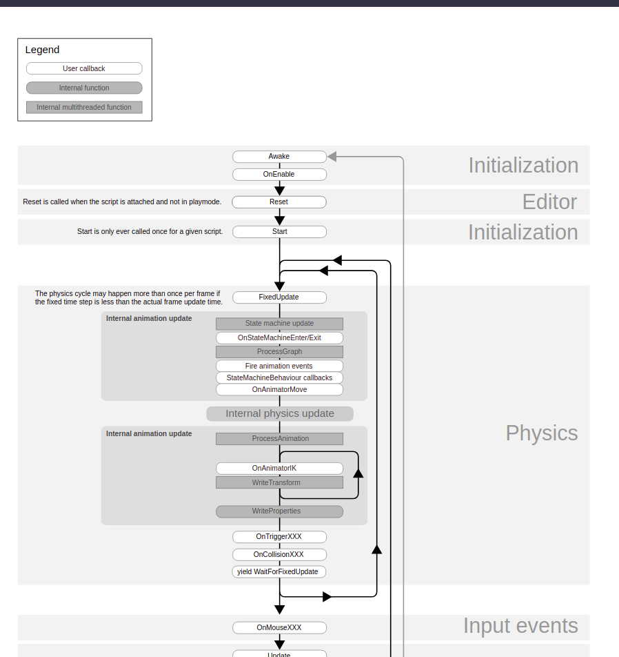
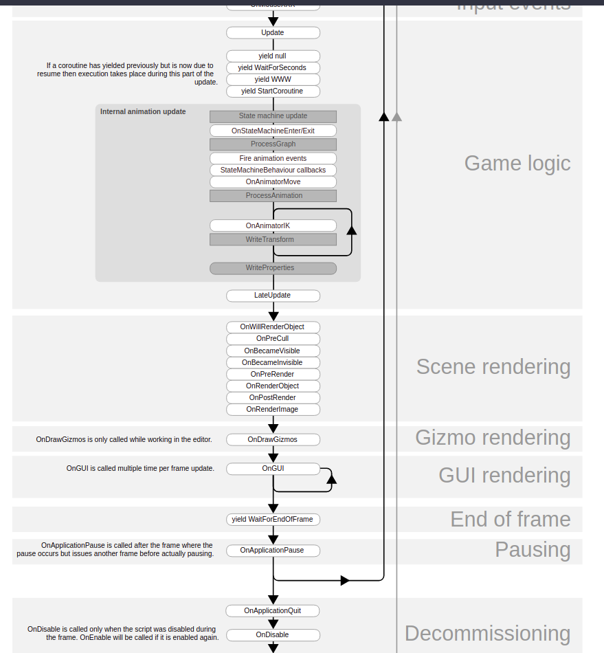
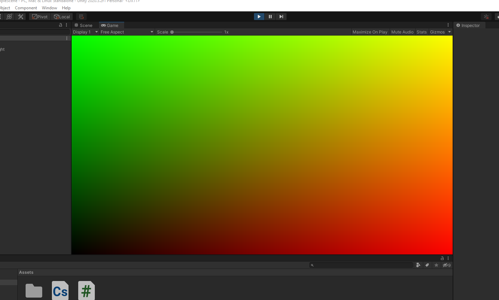

# Unity backend

## Unity script cycle

### Flowchart






### Execution order of event functions

***Before first frame update***

* The `start()` is called before the first frame update, onlöy if the script instance is enabled. 


***Inbetween updates***

* `OnApplicationPause`


!!! ***Rendering***

* Rendering the objects
* `OnPreCull`: Called before the camera culls the scene. Culling determines which objects are visible to the camera. OnPreCull is called just before culling takes place.
* `OnBecameVisible/OnBecameInvisible`: Called when an object becomes visible/invisible to any camera.
* `OnWillRenderObject`: Called `once` for each camera if the object is visible.
* `OnPreRender`: Called before the camera starts rendering the scene.
* `OnRenderObject`: Called after all regular scene rendering is done. You can use GL class or Graphics.DrawMeshNow to draw custom geometry at this point.
* `OnPostRender`: Called after a camera finishes rendering the scene.
* `OnRenderImage`: Called after scene rendering is complete to allow postprocessing of the screen image.
* `OnGUI`: Called multiple times per frame in response to GUI events. The Layout and Repaint events are processed first, followed by a Layout and keyboard/mouse event for each input event.
* `OnDrawGizmos` Used for drawing Gizmos in the scene view for visualisation purposes.

## Components


### GetComponent<Renderer>()

* Returns the current gameobject, specifically the `Renderer`
* This will be containing the texture of the object. 

# Shaders

## Basics

### Allmänt

* Shaders i unity baseras på olika språk: C, C#, och ett shader-specifikt språk.
* Regardless of which type you choose, the actual Shader code is always wrapped in ShaderLab, which is used to organize the Shader structure. It looks like this:

```c#

Shader "MyShader" {
    Properties {
        _MyTexture ("My Texture", 2D) = "white" { }
        // Place other properties like colors or vectors here as well
    }
    
    SubShader {
        // here goes your
        // - Surface Shader or
        // - Vertex and Fragment Shader or
        // - Fixed Function Shader
    }
    
    SubShader {
        // Place a simpler "fallback" version of the SubShader above
        // that can run on older graphics cards here
    }
}
```


## Compute Shaders

### Basics


***Like an extension of a c# script***

* The compute shader works like an extension of a C# script


***Basics***

* Similar to [regular shaders](https://docs.unity3d.com/Manual/class-Shader.html), compute shaders are Asset files in your project, with a *.compute* file extension. They are written in DirectX 11 style [HLSL](http://msdn.microsoft.com/en-us/library/windows/desktop/bb509561.aspx) language, with a minimal number of #pragma compilation directives to indicate which functions to compile as compute shader kernels.

* Here’s a basic example of a compute shader file, which fills the output texture with red:

  ```c
  // test.compute
  
  #pragma kernel FillWithRed
  
  RWTexture2D<float4> res;
  
  [numthreads(1,1,1)]
  void FillWithRed (uint3 dtid : SV_DispatchThreadID)
  {
      res[dtid.xy] = float4(1,0,0,1);
  }
  ```

* The language is standard [DX11 HLSL](https://docs.unity3d.com/Manual/SL-ShadingLanguage.html), with an additional `#pragma kernel FillWithRed` directive. 


***Kernel***

* One compute shader Asset file must contain at least one`compute kernel` that can be invoked, 

* and that function is indicated by the `#pragma directive`. 

* ***What this means:***  the `#pragma kernel FillWithRed` is that we are providing the name of the program, such that it can be called. 

* There can be more kernels in the file; just add multiple `#pragma kernel` lines

* When using multiple `#pragma kernel` lines, note that comments of the style `// text` are not permitted on the same line as the `#pragma kernel` directives, and cause compilation errors if used.

* The `#pragma kernel` line can optionally be followed by a number of preprocessor macros to define while compiling that kernel, for example:

  ```c
  #pragma kernel KernelOne SOME_DEFINE DEFINE_WITH_VALUE=1337
  #pragma kernel KernelTwo OTHER_DEFINE
  // ...
  ```

#### Project based

And the current one covers the basics: how to write, setup and run a compute shader that draws Mandelbrot Fractal.

I won't explain every line of code, will only cover GPU computation specific lines. So, it's better to open this project and check how the lines I described work.

There's nothing complex there. Let's see how it works.

First let's check the GPU side of the code. Compute shader that draws fractal is written on HLSL. I briefly commented the most important lines, deeper explanations will follow.

```c
// the program that runs in GPU accesses data videomemory in through "buffers"
RWTexture2D<float4> textureOut;						// this is the texture we draw pixels into
RWStructuredBuffer<double> rect;					// these are boundaries in fractal space that are currently visible on the screen
RWStructuredBuffer<float4> colors;					// this is a set of colors that has been prepared on CPU side and been written to GPU
#pragma kernel pixelCalc							// kernel name declaration, we'll use the name to call kernel from CPU side

[numthreads(32,32,1)]								// this directive defines the amount of threads this kernel will be runned in
void pixelCalc (uint3 id : SV_DispatchThreadID){	// we write kernel's code. id parameter contains thread's index and used to access the right data
    float k = 0.0009765625;							// this is simply 1/1024, used to project 1024x1024 texture space to a 2x2 fractal space
    double dx, dy;
    double p, q;
    double x, y, xnew, ynew, d = 0;					// we use double precision variables, to avoid precision limit for a bit longer while going deeper in the fractal
    uint itn = 0;
    dx = rect[2] - rect[0];
    dy = rect[3] - rect[1];
    p = rect[0] + ((int)id.x) * k * dx;
    q = rect[1] + ((int)id.y) * k * dy;
    x = p;
    y = q;
    while (itn < 255 && d < 4){						// the essense of the fractal: in this loop we check how many steps it takes for a point to leave 2x2 fractal area
        xnew = x * x - y * y + p;
        ynew = 2 * x * y + q;
        x = xnew;
        y = ynew;
        d = x * x + y * y;
        itn++;
    }
    textureOut[id.xy] = colors[itn];				// how we write pixel's color: id parameter defines the pixel, and number of steps defines color
}
```

Some of you may ask: texture size is 1024x1024, but there's only 32x32 threads. How then id.xy adresses the big texture area? Others may even ask: wait, how do you know there are 32x32 threads? and what's id.xy?

This line: [numthreads(32,32,1)] means we have 32x32x1 threads. It's like a 3d grid of threads. And id parameter adressing the cells of this grid. id.x has values in [0, 31] range, same range for id.y, and id.z equals 0. 

* id.xy is the same as uint2(id.x, id.y)

So, we should have 32x32 threads if we ran the kernel from CPU side with the ComputeShader class method, like this:

```c
Dispatch(kernelIndex, 1, 1, 1)
```

See those three "1"s? They define the number of threads the same way as the [numthreads(32,32,1)] line. They are being multiplied with each other, so this would give us 32x32 threads.

But if we did this:

```c
ComputeShader.Dispatch(kernelIndex, 2, 4, 1)
```

we would have 32 * 2 = 64 threads along x axis, 32 * 4 = 128 threads along y, 64х128 threads total. So, we just multiply the parameters along each axis.

But in our case we call our kernel like this:

```c
ComputeShader.Dispatch(kernelIndex, 32, 32, 1)
```

Which, along with that [numthreads(32,32,1)] line gives us 1024x1024 threads. So, id.xy index will have all the values to cover all pixels of 1024x1024 texture.

It's convenient to have the number of threads equal the number of data units. Because data is being stored in arrays, each thread applies the same operation to a data unit, and it makes array indexing very simple when our thread space dimensions and size is the same as data space dimensions and size.

That's it. Our fractal drawing shader is simple, so this is all you need to know about the shader part.

Now let's see what should we do on CPU side to run the shader we wrote.

Variables: shader, buffer and texture defined

```c#
ComputeShader _shader;
RenderTexture outputTexture;
ComputeBuffer colorsBuffer;
```

Initializing the texture, don't forget to turn enableRandomWrite on

```c#
outputTexture = new RenderTexture(1024, 1024, 32);
outputTexture.enableRandomWrite = true;
outputTexture.Create();
```

While initializing the buffer, we need to set number of data units and data unit size. Then we write the data to GPU from the array we have already filled with data

```c#
colorsBuffer = new ComputeBuffer(colorArray.Length, 4 * 4);
colorsBuffer.SetData(colorArray);
```

Initializing the shader and setting our texture and buffer for the kernel, so it could access that data

```c#
_shader = Resources.Load<ComputeShader>("csFractal");
kiCalc = _shader.FindKernel("pixelCalc");
_shader.SetBuffer(kiCalc, "colors", colorsBuffer);
_shader.SetTexture(kiCalc, "textureOut", outputTexture);
```

That's it, everything is prepared, now let's run the kernel

```c#
_shader.Dispatch(kiCalc, 32, 32, 1);
```

After this call our texture will be filled with the pixels. And we will see a nice colorful fractal, because we used this texture as mainTexture for the Image component of the object the camera is looking at.

#### Update loop

!!! You can see that every time user changes view rect by zooming or moving it***, the kernel will run to refresh the image.***

Now check the whole code once again to make sure you understand everything. If something is not clear - ask me please


### Default compute shader code

***Getting started***

```c#
// Each #kernel tells which function to compile; you can have many kernels
#pragma kernel CSMain

// Create a RenderTexture with enableRandomWrite flag and set it
// with cs.SetTexture
RWTexture2D<float4> Result;

[numthreads(8,8,1)]
void CSMain (uint3 id : SV_DispatchThreadID)
{
    // TODO: insert actual code here!

    Result[id.xy] = float4(id.x & id.y, (id.x & 15)/15.0, (id.y & 15)/15.0, 0.0);
}

```

* First line: `#pragma kernel CSMain` is providing the name of the program we want the compiler to run (note that ***we define this function later in the code***)
* ***The texture***: unity generates a texture, as a render texture TARGET. 
  * Specifies that unity will read and write to it as a ***variable***
  * The `RWTexture2D`
* `[numbthreads()]`: provides the dimensions thread groups to be used by our compute shader
  * keep in mind that the compute shader runs code in parallel on the  gpu
  * the numthreads provide how this computation on the gpu will be performed. 
* inside the `CSMain` function: 
  * it takes the texture `Result` and the given index o our thread (compute cell), and assigns it a color. 
* `float(4)` for color: we have a 4d-vector for the RGBa vector, I assume, that we are returning to the `Result` texture. 


***Compute shader has no target***

* Because the compute shader does not have a target, e.g. a mesh, 
* we need to tell it how, when, where it will run. 


***In unity***

* **C# script**: create a new C# script in unity. 
* Name it "ComputeShaderTest" 
* create a public reference to our compute shader inside the class: add `public ComputeShader computeShader;`


```c#
using System.Collections;
using System.Collections.Generic;
using UnityEngine;

public class NewBehaviourScript : MonoBehaviour
{

    // I wonder if we are calling a native template that is
    // the ComputeShader inside unity, or if it is the 
    // compute shader that we have scripted ourselves that 
    // we need to call, in that case the name is incorrect. 
    public ComputeShader computeShader; // assign our newly created shader to this. 
    public RenderTexture renderTexture;

    // Start is called before the first frame update
    void Start()
    {
        renderTexture = new RenderTexture(256,256, 24)
        renderTexture.enableRandomWrite = true;
        renderTexture.Create();


        computeShader.SetTexture(0, "Result", renderTexture);
    }

    // Update is called once per frame
    void Update()
    {
        
    }
}

```

* The `public ComputeShaader computeShader`: seems to get exposed in the unity editor. 
  * The `ComputeShader` seems to be a unity class. 
  * When we write `public [SomeClass] [name we provide]`: it will get exposed in the unity editor, and then I assume that we in turn specifically provide the name of our compute shader script. 
  * 
* `computeShader.SetTexture(0, "Result", renderTexture);`
  * assigning the texture to the our computeshader
  * First parameter of the `computeShader.SetTexture`, is the KERNEL INDEX (in this case `0`)
  * KERNEL INDEX: each kernel in our shader is assigned an index
  * because we only have one kernel (a single method CSMain) in our computeshader, we know 
  * it to have index 0 
  * otherwise we would be able to use the FindKernel method to find the kernel by name. 


***Getting a preview of the compute shader***

* The `Assets/ComputeShaderTest.`

```c#
using System.Collections;
using System.Collections.Generic;
using UnityEngine;

public class ComputeShaderTest : MonoBehaviour
{
    public ComputeShader computeShader;
    public RenderTexture renderTexture; 
    // Start is called before the first frame update
    void Start()
    {
        renderTexture = new RenderTexture(256, 256, 24);
        renderTexture.enableRandomWrite = true;
        renderTexture.Create();


        computeShader.SetTexture(0, "Result", renderTexture);
        computeShader.Dispatch(0, renderTexture.width / 8, renderTexture.height / 8, 1);
    }

    // Update is called once per frame
    void Update()
    {
        
    }
}

```

* and `Assets/ComputeShader_v1.compute`

* ```c
  // Each #kernel tells which function to compile; you can have many kernels
  #pragma kernel CSMain
  
  // Create a RenderTexture with enableRandomWrite flag and set it
  // with cs.SetTexture
  RWTexture2D<float4> Result;
  
  [numthreads(8,8,1)]
  void CSMain (uint3 id : SV_DispatchThreadID)
  {
      // TODO: insert actual code here!
  
      Result[id.xy] = float4(id.x & id.y, (id.x & 15)/15.0, (id.y & 15)/15.0, 0.0);
  }
  
  ```

* **Camera**: Next select the camera, and move the `ComputeShaderTest.cs` to the camera components, drag and drop

* **Play generates texture**: Next click play, such that the texture gets generated and stored in the `RenderTexture`  public class

* **Play and select field:** preview the generated texture, press PLAY and while in play select the `RenderTexture` field:

* 


#### Render the texture directly to the camera

* Continuing from above

* having placed the "ComputeShaderTest.cs" as a component to the camera,

* we want to override the `OnRenderImage` function, which will allow us to render the texture directly to the camera:

* ```c#
  public class ComputeShaderv1 : MonoBehaviour{
  
  	// bla bla 
      public void OnRenderImage(RenderTexture src, RenderTexture dest){
          if (renderTexture == null){
              renderTexture = new RenderTexture(256, 256, 24);
              renderTexture.enableRandomWrite = true;
              renderTexture.Create();               
          }
          computeShader.SetTexture(0, "Result", renderTexture);
          computeShader.Dispatch(0, renderTexture.width/8, renderTexture.height/8, 1);
          
          Graphics.Blit(renderTexture, dest);
      }
      
      // bla bla
  
  }
  
  
  ```

* Running the scene now, we will see the computeshader directly rendering to our screen. 

* `Graphivs.Blit`: copies ***sourve*** texture into ***destination*** texture **WITH A SHADER**. 

* With other words it seems that `Graphivs.Blit` that is driving the shader, to calculate the shit we want.


#### Twiddling with the compute shader

* We want a square texture
* in the "ComputeShader_v2" add outside of `CSMain`:
  * `float Resolution;`
* inside the `CSMain`, we change the code into:


```c#
void CSMain (uint3 id : SV_DispatchThreadID)
{
    // TODO: insert actual code here!
    float x = id.x / Resolution;
    float y = id.y / Resolution; 
    Result[id.xy] = float4(x, y, 0, 0);
}
```

* In effect we are taking the computeshader current cell, and dividing by the `Resolution`

* Next we want to give the `Resolution` a value, which we will be doing from our C# script, `ComputeShaderTestv2.cs`:

  

  ```c#
  {
  
  	// bla bla
      computeShader.SetTexture(0, "Result", renderTexture);
      computeShader.SetFloat("Resolution", renderTexture.width); // this is the new part
      computeShader.Dispatch(0, renderTexture.width/8, renderTexture.height/8 , 1);
  	// bla bla
  
  }
  
  // bla bla
  ```

* Where we use `computeShader.SetFloat` and the name of the float variable to set the value for the `Resolution`. 

* **Play** the scene now, and we will be seeing this:





## Buffers: compute buffers

***General***

* Great combination to achieve things that your cpu may struggle with


***Doing it***

* The idea is to generate a grid of cubes, and changing their colors with the help of our Compute Shader, and the compute buffer. 
* Create a new shader, called "RandomShader"
* Add a new `struct Cube`

```c#
struct Cube = {
    float3 position;
    float4 color;
};
```

* Also add a `RWStructuredBuffered<Cube> cubes;`. 
* it will be the data that will pass back and forth our compute shader. 

```
RWStructuredBuffer<Cube> cubes; 
```

* In our `CSMain` function, set the number of threads to be one dimensional, to keep it simple: `[numthreads(10,1,1)]`
* For now, let us retrieve the cube from our buffer, and return the color red:

```c#
#pragma kernel CSMain

struct Cube = {
	float3 position; 
	float4 color;
};

RWSstructuredBuffer<Cube> cubes;
float resolution


[numthreads(10,1,1)]
void CSMain(uint3 id: SV_DispatchThreadID){
	x_pos = id.x / resolution;
	Cube cube = cubes[id.x];
	cube.color = float4(x_pos, 0.0, 0.0, 1.0)
	
	cubes[id.x] = cube

}
```

***Setting up in the c# script***

* Start by creating the struct for our buffer to use


```c#
// bla bla 
using UnityEngine;

public struct Cube {
	public Vector3 position; 
	public Color color; 
}

public class ComputeShaderTestv2 : MonoBehaviour{

// bla bla
}
```

* Create an array in our class for our cube data:

```c#
using System.Collections;
using System.Collections.Generic;
using UnityEngine;


public struct Cube{
    public Vector3 position;
    public Color color;
}


public class ComputeShaderTestv2 : MonoBehaviour{
    public ComputeShader computeShader; // manually provide the compute shader 
    public RenderTexture renderTexture;
    // Start is called before the first frame update

    public Mesh mesh;
    public Material material;
    public int count = 50;
    public int repititions = 1;

    private List<GameObject> objects;
    private Cube[] data;


    public void CreateCubes()
    {
        objects = new List<GameObject>();
        data = new Cube[count * count];
        for (int x=0 ; x<count; x++){
            for (int y=0; y<count; y++){
                CreateCube(x,y);
            }
        }
    }


    private void CreateCube(int x, int y){
        GameObject cube = new GameObject("Cube_"+x*count+y, typeof(MeshFilter), typeof(MeshRenderer));
        cube.GetComponent<MeshFilter>().mesh = mesh;
        cube.GetComponent<MeshRenderer>().material = new Material(material);
        cube.transform.position = new Vector3(x,y, Random.Range(-0.1f, 0.1f));
        Color color = Random.ColorHSV();
        cube.GetComponent<MeshRenderer>().material.SetColor("_Color", color);


        objects.Add(cube);

        Cube cubeData = new Cube();
        cubeData.position = cube.transform.position;
        cubeData.color = color;
        data[x*count + y] = cubeData;
    }
    

    public void OnRandomizedGPU(){
        int colorSize = sizeof(float) * 4;
        int vector3size = sizeof(float) * 3;
        int totalsize = colorSize * vector3size;
        ComputeBuffer cubesBuffer = new ComputeBuffer(data.Length, totalsize);
        cubesBuffer.SetData(data);

        computeShader.SetBuffer(0, "cubes", cubesBuffer);
        computeShader.SetFloat("resolution", data.Length);
        computeShader.Dispatch(0, data.Length / 10, 1, 1);

        for (int i=0; i<objects.Count; i++){
            GameObject obj = objects[i];
            Cube cube = data[i];
            obj.transform.position = cube.position;
            obj.GetComponent<MeshRenderer>().material.SetColor("_Color", cube.color);
        }
    }

    private void OnGUI(){
        if(objects == null){
            if(GUI.Button(new Rect(0,0,100,50), "Create")){
                CreateCubes();
            }
        }
        else{
            if (GUI.Button(new Rect(0,0,100,50),"Random GPU")){
                OnRandomizedGPU();
            } 

        }
    }


    void Start(){

    }

    // Update is called once per frame
    void Update(){

    }
}

```

* The `ComputeBuffer` needs to know the size of the data. 
  * hence we use the `sizeof` method to provide it with that: `int colorSize = sizeof(float) * 4` // becuase the color is  a `float4`


***Output:***

* When hitting play:


### Delving into the buffers

Modifying texture data is a bit too much like vert/frag shaders for me to get too excited; it’s time to unshackle our GPU and get it working on arbitrary data. Yes it’s possible, and it’s as awesome as it sounds.

A structured buffer is just an array of data consisting of a single data type. You can make a structured buffer of floats, or one of integers, but not one of floats and integers. You declare a structured buffer in a compute shader like this:

```c#
StructuctedBuffer<float> floatBuffer;
RWStructuredBuffer<int> readWriteIntBuffer;
```

* What makes these buffers more interesting though, is the ability for that data type to be a struct, which is what we’ll do for the second (and last) example in this article.

* For our example, we’re going to be passing our compute shader a set of points, 

  * each of which has a matrix that we want to transform it by. 

* We could accomplish this with 2 separate buffers (one of Vector3s and one of Matrix4x4s), 

* but it’s easier to conceptualize a point/matrix pair if they’re together in a struct, so let’s do that.

* In our c# script, we’ll define the data type as follows:

  ```c#
  struct VecMatPair
  {
      public Vector3 point;
      public Matrix4x4 matrix;
  }
  
  ```

* We also need to define this data type inside our shader, 
* but HLSL doesn’t have a Matrix4x4 or Vector3 type. 
* However, it does have data types which map to the same memory layout. 
* Our shader might end up looking like this:

```c#
#pragma kernel Multiply

struct VecMatPair
{
	float3 pos;
	float4x4 mat;
};

RWStructuredBuffer<VecMatPair> dataBuffer;

[numthreads(16,1,1)]
void Multiply (uint3 id : SV_DispatchThreadID)
{
    dataBuffer[id.x].pos = mul(dataBuffer[id.x].mat,
    				float4(dataBuffer[id.x].pos, 1.0));
}

```

* Notice that our thread group is now organized as a 1 dimensional array. There is no performance impact regarding the dimensionality of the thread group, so you’re free to choose whatever makes the most sense for your program.


### Setting up the buffers

Setting up a structured buffer in a script is a bit different from the texture example we did earlier. 

* For a buffer, you need to specify how many bytes a single element in the buffer is, 

* and store that information along with the data itself inside a compute buffer object. 

* For our example struct:, 

  * the size in bytes is simply the number of float values we are storing (3 for the vector, 16 for the matrix) 
  * multiplied by the size of a float (4 bytes), 
  * for a total of 76 bytes in a struct. 

* Setting this up in a compute buffer looks like this:

* ```c#
  public ComputeShader shader;
  
  void RunShader()
  {
  	VecMatPair[] data = new VecMatPair[5];
  	//INITIALIZE DATA HERE
  
  	ComputeBuffer buffer = new ComputeBuffer(data.Length, 76);
  	buffer.SetData(data);
      
  	int kernel = shader.FindKernel("Multiply");
  	
      shader.SetBuffer(kernel, "dataBuffer", buffer);
      
  	shader.Dispatch(kernel, data.Length, 1,1);
  }
  
  ```

  #### !!! Getting the data back

  Now we need to get this modified data back into a format that we can use in our script. 

  * **Unlike the example above with a render texture**, structured buffers need to explicitly be transferred from the GPU’s memory space back to the CPU. 
  * In my experience, this is the spot where you’ll notice the biggest performance hit when using compute shaders, 
  * and the only ways I’ve found to mitigate it are to optimize your buffers so that they’re as small as possible while still being useable and to only pull data out of your shader when ***you absolutely need it.***

  

  The actual code to get the data back to the cpu is actually really simple. All you need is an array of the same data type and size as the buffer’s data to write to. If we modified the above script to write the resulting data back to a second array, it might look like this:

  ```c#
  public ComputeShader shader;
  
  void RunShader()
  {
      VecMatPair[] data = new VecMatPair[5];
      VecMatPair[] output = new VecMatPair[5];
  
      //INITIALIZE DATA HERE
  
      ComputeBuffer buffer = new ComputeBuffer(data.Length, 76);
      
      buffer.SetData(data);
      
      int kernel = shader.FindKernel("Multiply");
      
      shader.SetBuffer(kernel, "dataBuffer", buffer);
      
      shader.Dispatch(kernel, data.Length, 1,1);
      
      buffer.GetData(output);
  }
  ```

That’s really all there is to it. You may need to watch the profiler for a bit to get a sense of exactly how much time you’re burning transferring data to and from the cpu, but I’ve found that once you’re operating on a big enough data set compute shaders really pay dividends.

One last thing - once you’re done working with your buffer, you should call buffer.Dispose() to make sure the buffer can be GC’ed. (


## ComputeShader Delve

**Actual tutorial starts here**

If you want to build a physics simulation on GPU, you can cut the whole task to these 4 parts:

- math model of the simulated object
- general algorithm
- actual shader code
- cpu side shader and data preparations


**Math model**

The good thing about videocards is that they can apply a set of instructions to a big amount of data units. We'll use it by implementing hair model as a number of points, and each one will interact with its neighbors by the same rules. So, it can be easily paralleled. The interaction between the points will be spring-alike:

```
k * (S0-S)^n
```

where S0 - is an equillibrium distance, and S - current distance.

In reality a hair is not a spring, it has a constant length. So, we need to make our spring hard. It's better to do it by increasing the "n" - the power factor. Because it makes the curve of force steeper in the area of equilibrium. I decided to have n = 2. The meaning of "k" factor we will discuss a bit later.

Besides the spring-alike force, there will be velocity diffusion implemented between the points. Tangential component of relative force models dynamic resistance to stretching. Normal component of the relative velocity models dynamic resistance to flexing. They both would improve hair's dynamic, make it look less spring-alike.

Also, we will have a static flexibility related force. Each point will tend to compensate the bending. The force will be proportional to bending degree and point to the direction of reducing the bending. Neighbor points will recieve oppositely pointed force of the halved intensity, so the sum of all flexibility related forces wouldn't move the whole hair.

Together these interactions simulate a hair nicely. But we will add something else. We want our hairs to interact with solid bodies. Physics siumlations in general use different kinds of objects that interact with each other, for example liquid and solid shapes. But also because I write this tutorial for game developers, and there's no point for us to implement anything that doesn't interact with the CPU side game world. GPU side things must interact with anything on CPU side. So, we will make our hairs interact with scene objects, by putting information about those objects to GPU memory and then reading the forces hairs affected those objects with.

For the sake of simplicity we will only do this for circle 2d colliders from standard unity physics. It can be extended to all other kinds of colliders, but I only want to show the approach, then you will be able to improve it, to make it work with all kinds of data you want. So, only circle colliders in our case.

Hairs will interact with scene objets like this: if hair's point find itself inside a solid body, it will be moved to the closest surface point of the body, and also hair point and the body will exchange impulses. A fraction of point's velosity that points to the body will be substracted from the point's whole velocity, and then will be added to the body's velocity. We will not take into account body's current velocity. It would be more correct to do, but we won't, for simplicity.

#### Declaring the struct **twice**

**Algorithm, shader code and CPU side shader preparation**

These three are too related to each other, so we will go through them in parallel.

To describe a point we model our hair with, we will use this struct:

```
struct hairNode{
    float x;			// 2d position of the point
    float y;			//
    float vx;			// 2d velocity
    float vy;			//
    int dvx;			// sum of forces or change of velocity in the current frame
    int dvy;			//
    int dummy1;			// these two parameters added to make struct's size divisible by 128 bit
    int dummy2;			//
}
```


!! ***This struct is declared twice***: on GPU and on CPU sides. For convenience. 

* On CPU side we initialize the array of this struct with the initial coordinates of the points. 
* Then we copy this data to GPU. 
* But if we did not need to pass the initial values to GPU, we can declare this struct only on the GPU side.

About those dummy1 and dummy2 parameters. Reading from GPU side buffer takes some calculations. And if we keep the stride aliquot to 128 bit, it will take less inner core calculations to get access to the data unit - no additional offset calculations will be needed. Therefore nvidia engineers advise to add empty variables to structs to make them fit this condition.

#### Protected writing operation avoid data loss

I hope the meaning of other vaules of the point struct are understood. Though, an attentive reader might ask: why is position and velocity have float type, and forces are int? Short answer: because forces are being modified in parallel by different threads. So, we need to use protected writing operation to avoid data loss. But protected data access functions only work for int and uint values. So, we have force as int. I'll describe this later with more details.

#### The Buffer !

We have alot of points we model the hairs with. 

* Number of hairs multiplied by number of points per hair. 
* Alot. 
* !! **This data is stored in GPU as a buffer:**

```c#
RWStructuredBuffer<hairNode> hairNodesBuffer;
```

* In **shader, we can only declare buffer name and it's type**. 
* !!! **The size: While its size is being setup from outside, from CPU side.**

#### Structure of shader code

Now let's see how shader code is acatually structured. 

* Shader code is made of kernels. 
* They are like methods. 
* But each kernel runs in many threads in parallel. 
* Therefore, for each kernel we need to set the amount of threads it should run in. 
* Number of threads is a three dimentional value. 
* It has x, y and z axes. Which corresponds to GPU architecture. 
* But we don't have to use all three dimensions. 
* For example, if we are doing something with a 1024x1024 texture, we can have 1024x1024 threads (threads per each pixel).

This is how an empty kernel looks like:

```c#
#pragma kernel kernelName
[numthreads(8,4,1)]
void kernelName (uint3 id : SV_DispatchThreadID){
    // actual code should be here
}
```

Kernel has "id" parameter. It provides thread index. Which is very convenient, it is being used to access a specific data unit. Remember I mentioned 1024x1024 texture being computed thread-per-pixel by 1024x1024 threads? Pixels would be adressed by the "id" parameter:

```
texture[id.xy] = float(1, 1, 1, 1);
```

or (which is the same)

```
texture[uint2(id.x, id.y)]
```

##### The call for kernel from CPU and the number of threads

By the way. From the CPU side a kernel is being called by a method from ComputeShader class, like this:

```c#
shaderInstance.Dispatch(kernelIndex, 2, 2, 1);
```

Those numbers "2, 2, 1" are related to the line that follows shader name declaration in shader:

```
[numthreads(8,4,1)]
```

These two triplets of numbers define the amount of threads the kernel should run in. We just have to multiply them axis by axis. In our case: "2, 2, 1" at Dispatch() and "8, 4, 1" at numthreads(). So, the kernel will run in 2 * 8 = 16 by x, and 2 * 4 = 8 by y dimension. 16 * 8 threads.

So, once more. On CPU side we call a kernel like this:

```
Dispatch(kernelIndex, X, Y, Z);
```

On GPU side kernel has this directive:

```
[numthreads(x,y,z)]
```

!! And as a result the kernel will run in $(X \times x) \times (Y \times y) \times (Z \times z)$ threads.

##### Example of threads

Example: we need to process every pixel of the 256x256 texture, and we want to go thread-per-pixel approach. So, on CPU side we define the number of threads this way:

```
Dispatch(kernelIndex, 16, 16, 1);
```

and on shader side:

```
[numthreads(16,16,1)]
```

Inside the kernel id.x will have [0, 255] range, same for id.y

And, pixels will be written like this:

```
texture[id.xy]=float4(1, 1, 1, 1);
```

it will paint white all 65536 pixels

Hope this part about the number of threads is understood, but if not, you might want to go through that simple tutorial I linked in the introduction to this tutorial.

But if you got the idea, let's go further and see how does the shader code look.


#### The kernels

Our shader code contains a few kernels, that being called one after another from Update() method on CPU side. I'll explain each kernel's code later, now let's see what role each kernel plays.

* `calc`: tangential and normal components of the force between the points is being calculated. Remember we model the hair as a set of points? these points interact with a springalike force, which pulls them. Also, there's a flexibility related force, that compensate the curves and pushes the points perpendicular to the line between theri neighbors. The forces calculated for each perticle is being stored in its dvx and dvy parameters.
* `velShare`: points exchange fractions of relative speed between each other. Tangential and normal components separately. Tangential component should be exchanged more intensively, so we first extract it and make the exchange with a bigger factor. And then we exchange a smalle fraction of the full velocity. Velocity changes we again store in dvx and dvy variables of each point.
* `interactionWithColliders`: each point interacts with the colliders that we provided the info about from CPU side
* `calcApply`: the forces we have calculated in the previous kernels are modifying points' velocities, and then velocities are used to modify points' positions
* `visInternodeLines`: lines are being drawn between the points, but they are being drawn on a 1024x1024 buffer instead of texture
* `pixelsToTexture`: here we move the pixels from the buffer to the actual texture
* `clearPixels`: all pixel data from the buffer are being removed
* `clearTexture`: the texture is being cleaned
* `oneThreadAction`: this kernel runs in a single thread, it's purpose is to move the whole system of hair to the point user's imput wanted it to move. Instead of teleporting it to the desired point, this thread moves it smoothly. To avoid instability in the system, because forces are a power of two of the distance, and they would be enormous if we jumped the system of hair in one step

#### How to prepare a shader and run it

Declaring a variable:

```
ComputeShader _shader;
```

Initializing the variable by providing a shader file: (We can also do this manually by using a `public ComputeShader shader;`and select it from the outside)

```c#
_shader = Resources.Load<ComputeShader>("shader");
```

Setting up the constants we will need on GPU side, we do it from the CPU side:

```c#
// nodesPerHair and nHairs variables are already initialized
_shader.SetInt("nNodsPerHair", nodesPerHair);
_shader.SetInt("nHairs", nHairs);
```

#### Initializing the buffers

Declaring the arrays, which will contain points' data. Also declaring the buffer we will use to write data to GPU

```c#
hairNode[] hairNodesArray;
ComputeBuffer hairNodesBuffer;
```

Initializing the buffer and writing data to GPU

```
// hairNodesArray is already initialized with the points' data
hairNodesBuffer = new ComputeBuffer(hairNodesArray.Length, 4 * 8);
hairNodesBuffer.SetData(hairNodesArray);
```

For each kernel: we are setting the buffers that are used by the kernel, so it would read and write to those buffers

```c#
kiCalc = _shader.FindKernel("calc");
_shader.SetBuffer(kiCalc, "hairNodesBuffer", hairNodesBuffer);
```

When all buffers are set for all kernels, we can finally run the kernels.

All kernels are being run from Update(). We shouldn't call it from FixedUpdate(), it will work very slow, because graphics pipeline is synchronized with Update().

All kernels are being run in this sequence. I now provide the full text of the doShaderStuff() method that is being called from Update()

```c#
void doShaderStuff(){
    int i, nHairThreadGroups, nNodesThreadGroups;
    nHairThreadGroups = (nHairs - 1) / 16 + 1;
    nNodesThreadGroups = (nodesPerHair - 1) / 8 + 1;
    _shader.SetFloats("pivotDestination", pivotPosition);
    circleCollidersBuffer.SetData(circleCollidersArray);
    i = 0;
    while (i < 40) {
        _shader.Dispatch(kiVelShare, nHairThreadGroups, nNodesThreadGroups, 1);
        _shader.Dispatch(kiCalc, nHairThreadGroups, nNodesThreadGroups, 1);
        _shader.Dispatch(kiInteractionWithColliders, nHairThreadGroups, nNodesThreadGroups, 1);
        _shader.Dispatch(kiCalcApply, nHairThreadGroups, nNodesThreadGroups, 1);
        _shader.Dispatch(kiOneThreadAction, 1, 1, 1);
        i++;
    }
    circleCollidersBuffer.GetData(circleCollidersArray);
    _shader.Dispatch(kiVisInternodeLines, nHairThreadGroups, nNodesThreadGroups, 1);
    _shader.Dispatch(kiClearTexture, 32, 32, 1);
    _shader.Dispatch(kiPixelsToTexture, 32, 32, 1);
    _shader.Dispatch(kiClearPixels, 32, 32, 1);
}
```

One can notice there's a set of kernels that are being ran 40 times per update. Why? To compensate the small time step and still have the simulation work fast in realtime. Why is time step small? To reduce discretization error, to make the system work more stable. Why is it unstable when big time step causes big discretization error? If time step is big and a big force is applied to a point, it will fly far, to a greater distance than it were from the equilibrium position. So, on the next step the force is stronger, the point flies to even greater distance. And the system goes crazy, points just fly chaotically with increasing amplitude. Smaller step makes all force curve smooth, error is small, and system works correctly.

So, instead of a big step, we perform 40 small steps. This makes computations precise. And that allows to use bigger forces without risking to fall into instable state. Bigger forces are good, they turn a wobbly exploding spaghetty into a nice strong hair.

The data of the points we use to model hair are stored in gpu side memory as a buffer, which is a random access one dimensional array. You remember, each thread has id parameter, that has thread's 2d index. We went the thread-per-point approach, so the index addresses one of the points. id.x is a number of hair, and id.y is point's index, so we access the point this way: hairNodesBuffer[id.x * nNodesPerHar + id.y]

You also remember, that total number of threads a kernel is runned in depends on Dispatch() method parameters on CPU side and [numthreads()] directive parameters in shader code. In our case all kernels that work with the points have [numthreads(16,8,1)] directive. So, Dispatch() method's parameters must be defined the way to provide total amount of threads not less than the amount of points. Here's how we calculate parameters for Dispatch() method:

```
nHairThreadGroups = (nHairs - 1) / 16 + 1;
nNodesThreadGroups = (nodesPerHair - 1) / 8 + 1;
```

The relationship between [numthreads()] and Dispatch() comes from GPU architecture. The first one is the number of threads in a thread group. The sedond one is the number of thread groups. Their ration affects how fast till all kernels be executed. If we need 1024 threads by x axis, it's better to have 32 thread groups and 32 threads per group. Better than 1024 threads and one group. To answer the "why" question, I'd have to describe too much about GPU architecture, so, let's just not waste our time on that. For practical reasons there's one advice: try to keep number of threads and number of thread groups about even.

**The actual physics code in the shader**

Alright, so 40 times per update we run the kernels that handle all physics between the points. Let's have a closer look to each of those kernels. There's nothing fancy, we just need to learn how to deal with buffer data.

"calc" kernel calculates forces between the points. The points are stored sequentially in "hairNodesBuffer" buffer. First point of first hair first, then second point, then all of them till the last point of the first hair, then first point of the second hair. And so on for all points of all hairs. id.x is hair's number, id.y is point's number, so this is how we actuall get the point in shader code:

```
int nodeIndex, nodeIndex2;
hairNode node, node2;
nodeIndex = id.x * nNodesPerHair + id.y;
nodeIndex2 = nodeIndex + 1;
node = hairNodesBuffer[nodeIndex];
node2 = hairNodesBuffer[nodeIndex2];
```

nNodesPerHair is a constant we've set on init from GPU side. You can see that buffers data has been copied to local variables node and node2. It's done becasue reading from buffer may take more inner core cycles than reading local variable, so we just save some computational timy by using local variables for data reads. The actual algorithm is the following: for each point (if it's not hair's last) we calculate the force between this point and the next one. And we wirte this force to the current point and reversed force value to the next point.

There's an important thing to note: each thread modifies two points: the current one and the next one. Which means every point is being modified by two parallel threads. This might lead to data lose. Let me explain this. If we use a normal increment like this:

```
variable += value;
```

this operation might happen in the same time. First thread will copy data, add value, but before it write the result back, the second thread will copy the data. Then the first thread will write the modified data back. Then the second thread will write the result too. Even though both threads did implement, the result will only have one increment. TO avoid this we must use protected writing. HLSL has some functions for protected writing, they guarantee that every thread's data change will be performced.

But there's a little problem: those protected writing functions only work for int or uint data types. And that is the reason we used int type for dvx and dvy variables in our point data struct. It allows us to let many threads write to those variables, and each thread's contribution will be safely applied. But we have to store float numbers as int, right? To avoid losing precision, we are using multipliers, to project small range float values to the whole range of int data type. We do lose some precision though, but it's negligibly small.

Protected writing looks like this:

```
InterlockedAdd(hairNodesBuffer[nodeIndex].dvx, (int)(F_TO_I * (dv.x + 2 * dvFlex.x)));
InterlockedAdd(hairNodesBuffer[nodeIndex].dvy, (int)(F_TO_I * (dv.y + 2 * dvFlex.y)));
InterlockedAdd(hairNodesBuffer[nodeIndex2].dvx, (int)(F_TO_I * (-dv.x - dvFlex.x)));
InterlockedAdd(hairNodesBuffer[nodeIndex2].dvy, (int)(F_TO_I * (-dv.y - dvFlex.y)));
```

F_TO_I is the multiplier I mentioned to project float to int. dvFlex is the un-bending force we calculated. "(int)" cast is used to explicitly cast the result to int, becasue InterlockedAdd() function is reloaded for int and uint, and by default interprets data as uint, which we don't like, because there are negative values used.

"velShare" kernel is similar to the previous one, dvx and dvy of each particle are being modified here, but instead of forces here we calculate velocity exchange between the neighboring points

In "interactionWithColliders" points do not interact with each other. Each point here `checks every collider from colliders buffer. So evem if there's some interaction with a collider, every thread only writes to one and only one point, and therefore we don't need to use protected writing functions. But points should add their impulse to the collider they have interacted with, and there might be many threads that need to write impulse change to the collider data, so we will use protected writing to write impulses to the colliders.

A note: when we project float to int, the greater the multiplier, the better precision will be. But greater precision means less value range. Because there's only 32 bit in te integer, and multiplier decides how many bits work for value range, and how many for precision. For the points we picked an appropriate multiplier, that allows good range and enough precision. But when we write impulses to the collider, we don't know how much range we will need. Hundreds of points might add their impulses to the collider. So we used a much smaller multiplier for this case. We lost precision, but won value range.

After all interactions between the points are calculated, in "calcApply" kernel we add impulse to velocity, and velocity to position. Also, int this kernel first point of each hair is being positioned relatively to the system of all hairs position. Also in this carnel gravity is being added to vertical component of velocity. And finally, velocity is being multiplied by a factor slightly less than 1 to model slowing the hairs down because of friction with air.

A note: in "calcApply" kernel velocity affects position through "sPosRate" factor. It defines simulation's time step size. It is set up on CPU side by a variable named "simulationSpeed". The bigger this parameter is, the faster the model will evolve in time but the bigger will be error. As I mentioned before, big error limits strength of forces between points. So we used small step size, which provided higher precision of calculations, which allowed higher forces, which defined more realistic behavior of simulated model.

Strength of force is defined be "dVelRate" factor. It defines how much interaction between the points will affect their velocities. This factor is big, it's defined on CPU side in the "strengthOfForces" variable.

Now let's get back to doShaderStuff() method on CPU side. After doing the 40 cycles loop block of kernels colliders data is being read from GPU:

```
circleCollidersBuffer.GetData(circleCollidersArray);
```

The structure we used to contain collider related data to pass it to GPU has dvx and dvy parameters, which are being used to store the impulses from hair points each collider gets. After we have read colliders data from GPU we use those parameters simply as a force vector to be applied to collider's rigidbody. This force is being added to rigidbody in FixedUpdate(), because physics system is synchronized with it. But the data is being read from GPU in Update() method. Update() and FixedUpdate() are not synchronized with each other, so two Updated() may happen after one FixedUpdate() and vice verse. This means some data about hairs->colliders impulses might be rewritten before it's used. Or same data used twice. But it's not important actually. We could add some measures to fix this little issue, but we didn't, no reason to add extra complexity to this simple example.

A note: GetData() method stalls graphics pipeline, which slows program's flow. There's no asynchronous version of this method in Unity yet. But rumors are it will be implemented in 2018. But for now you shoud know: if you need to get data from GPU, the program will work 20-30% slower. In the same time SetData() method doesn't have this effect and works fast.

**Visualization**

The rest of the kernel we run in doShaderStuff() method are all about visualization.

Let's see how is the visualization done. On CPU side we have declared RenderTexture variable (don't forget to set enableRandomWrite = true), and this texture is used as mainTexture for Image component's material. Also, SetTexture() method is called for the kernel that writes pixels to this texture, to bind shader side texture and CPU side texture. This is what we have done on CPU side:

```
RenderTexture renderTexture;
renderTexture = new RenderTexture(1024, 1024, 32);
renderTexture.enableRandomWrite = true;
renderTexture.Create();
GameObject.Find("canvas/image").GetComponent<UnityEngine.UI.Image>().material.mainTexture = renderTexture;
_shader.SetTexture(kiPixelsToTexture, "renderTexture", renderTexture);
```

On GPU side there's RWTexture2D<float4> variable declared, and rendering kernel writes pixels to this texture:

```
RWTexture2D<float4> renderTexture;
```

And this is the kernel used to clear texture before rendering the next frame.

```
#pragma kernel clearTexture
[numthreads(32,32,1)]
void clearTexture (uint3 id : SV_DispatchThreadID){
    renderTexture[id.xy] = float4(0, 0, 0, 0);
}
```

On CPU side this kernel is being runned like this:

```
_shader.Dispatch(kiClearTexture, 32, 32, 1);
```

We can see this gives us 1024x1024 threads, thread per pixel. Which again is convenient, so we simply use id.xy to reference thread's pixel.

How exactly are the hairs being drawn? They are nothing but lines betwen the points. I decided to make the hair semitransparent, so if they intersect, the color would be brighter. This again requires protected writing, because two threads can write to the same pixel. Also, our texture has float4 data type: RWTexture2D<float4>, so instead of writing to it, I had to use a buffer of int, and perform protected writing to it.

After "visInternodeLines" kernel wrote all lines, we just copy that int buffer's data to the actual texture in another kernel. In this visualization method no colors have been used, just shades of white. But there wouldn't be any troubles with the color, we could use int4 as buffer's type and save color, or color could be encoded in one int as four 8 bit colors.

Byt the wey this whole render method with render texture doesn't work on Macs, and I couldn't get the answer to the "why" question on official unity forums. There are other render methods, for example, hair points could control mesh vertexes. But I haven't learned these methods yet.

After "pixelsToTexture" kernel have modified the texture, we see the hair on the screen.

And this completes our tutorial. I explained all code involved into GPU computation from our little example. And you can see it's alot of information. If you plan to experiment further in this area, I recommend to write a simple GPU computing program to test your fresh knowledge. Would be useful. Just write a shader with only one kernel, that would replace each number from a buffer with its power of two. On CPU side prepare the buffer and write its data to GPU. Then run the kernel, get the result from GPU and check if it worked as intended. If you manage to create this little program, the tutorial did its best for you and you can go further

# Errors

### Monobehavior

* Make sure that the `public class [name]` matches the name of the script. 

# Projects

## Wireframe

* Add 3d cube to the env
* `create new shader`: Create > Shader > Standard Surface Shader


***Setting the menu location for the shader***

```c#
Shader "Simple Talk/Wireframe"
{
    Properties
    {
        _Color("Color", Color) = (1,1,1,1)
        _Wireframe("Wireframe thickness", Range(0.0, 0.005)) = 0.0025
        _Transparency("Transparency", Range(0.0, 1)) = 0.5
    }
    
}
```

* When editing any ***material*** there is a ***shader*** menu, you can navigate to select which shader this material use. 
* In this case 


***Properties***

* The general structure of a property is the variable name, 
* the property’s designation in the editor, what kind of property it is, and then a default value. 
* For example, the first variable is given the name `_Color` while in the editor it will display as whatever is in the quotations. 
* Then you specify that it will be of the `Color` value type and give it a default color of white: `(1,1,1,1)` 
* `_Wireframe` and `_Transparency` are a little different in that their value types are given as a range of floats. 
* This means in the Unity editor those variables can be edited by moving a slider


***Subshader***

* Next comes the `SubShader`, which defines rendering passes and optionally can set up any state common to all passes. 
* In other words, it’s the part that makes the shader what it is. 
* The `SubShader` goes inside the Shader under the `Properties {}` - section.


```c#
Shader "Simple Talk/Wireframe"
{
    Properties
    {
        _Color("Color", Color) = (1,1,1,1)
        _Wireframe("Wireframe thickness", Range(0.0, 0.005)) = 0.0025
        _Transparency("Transparency", Range(0.0, 1)) = 0.5
    }
    
    
    SubShader
    {
        Tags { "Queue" = "Transparent" "RenderType" = "Transparent"}
        Lod 200
            
        Pass
        {
            Blend SrcAlpha OneMinusSrcAlpha
            Cull Back
                
            // All remaining code goes in Pass
        }
    }    
}
```


***Material born from this shader***

* material born from this shader to be transparent, give the subshader:
  * render type "Transparent"
  * queue "Transparent": remove this tag, to have a full object, with wires around it,. 
* Let unity know that it is able to "fade". 
* The reason is simple – it doesn’t affect anything. Materials appear to ignore the alpha value in the color selection on primarily focus on the RGB values. At that point, the biggest reason to keep the alpha value is tradition.
* Tags can also be queried later in other C# scripts for whatever purpose you may need. This is similar to the typical tagging system seen when creating an object in Unity. Finally, there’s the `LOD` line with a number beside it. `LOD` stands for Level Of Detail and controls, you guessed it, the level of detail in the material. For example, if an object has a material that makes it look like a concrete tile, the LOD controls how nice looking that concrete tile can be. You would typically have multiple LOD options for various computer builds but since this is a wireframe shader it’s reasonable to assume that the material derived from this shader could run on a toaste


***SubShader Pass***

* Within `SubShader` you now must create a `Pass`. All the prep work is out of the way, meaning `Pass` will contain the code that defines the material’s appearance.
* The `Blend` line exists to create transparent objects and nothing more. 
* `Cull Back` is you telling Unity to ***not render polygons*** facing away from the viewer. 
* There is also `Cull Front`, which does the opposite of `Back` and stops the rendering of polygons facing the viewer, and `Cull Off` which draws all polygons regardless if they are currently being viewed. 
* This example chose `Cull Back` with the belief that it looks better but you may adjust this as you wish.


***Create the shader***

* It’s now time to put those properties to use in some functions and structs. Before beginning, you’ll need to let Unity know that Cg is in use until otherwise noted by adding the following in `Pass`

```c++
CPROGRAM
```

Then:

```c++
CPROGRAM

#pragma vertex vertexFunction
#pragma fragment fragmentFunction
#pragma geometry geometryFunction
#include "Unity.CG.cginc"

struct v2g
{
    float4 pos : SV_POSITION;
};

struct g2f;
{
    float4 pos : SV_POSITION
    float3 bary : TEXCOORD0;
}
```


***Pragmas and include***

* The pragma statements are very much like method declarations that you may normally find in a C# scrip
* They will be defined later in the coding process
* At the end there’s an include statement, which lets the editor know you’ll be using some commonly used helper functions from that library.


***vector***

* `v2g` stands for `vector 2 geometry` and contains a single variable – a float4 named `pos`, with `SV_POSITION` being what’s known as a semantic. 
* Semantics is how you explain to the editor what the variable’s “intent” is. 
* In this case, the intent is to output the clip space position of a vertex, this way the GPU knows where on screen to place pixels. 
* The next struct, `g2f` (standing for *geometry 2 fragment*) has all the same info as `v2g` but with an additional float3 named `bary` which uses the `TEXCOORD0` semantic. 
* `TEXCOORD0` is simply the first `UV` coordinate in the shader, given as a float3 in this example but can also be done with float2 or float4.


***vertexFunction***

```c++
v2g vertexFunction(appdata_base v){
    v2g o;
    o.pos = UnityObjectToClipPos(v.vertex);
    return o;
}
```


***geometryFunction***

* Earlier you wrote some pragma statements, which acted effectively as function declarations. 
* It’s time to give those functions a little code to execute. 
* First up is `vertexFunction` which, as the name suggests, gets the various vertexes ready for the next two functions.
* Then comes `geometryFunction`:


```c++
[maxvertexcount(3)]
void geometryFunction(triangle v2g IN[3], inout TriangelStream<g2f> triStream){
    g2f o; 
    float3 coords[3] = {
        float(1,0,0),
        float(0,0,1),
        float(0,1,0)
    }
    for(int i=0; i<3; i++){
	    o.pos = IN[i].pos
    	o.bary = coords[i];
	    triStream.Append(o);
        
    }    
}
```

* Here the different triangles that make up an object are being drawn. 
* This is possibly the busiest function in the whole script, though you’ll notice a pattern – a few lines of code are being repeated, just with different elements in the `IN` array and the `bary` value from the `g2f` struct being given different float3 values each time. 
* There’s also an attribute at the top of the function specifying that the maximum vertex count per shape is three, which makes sense as it is triangles being drawn and thus only need three vertexes per triangle. 


***Fragmentfunction***

* The last step remaining is to change the object based on the color, thickness and transparency values the user enters.


```c++
float _Wireframe;
fixed4 _Color;
float _Transparency;
fixed4 fragmentFunction(g2f i) : SV_TARGET{
    float value = min(i.bary.x, (min(i.bary.y, i.bary.z)));
    value = exp2(-1 / _Wireframe * value * value);
    fixed4 col = _Color;
    col.a = _Transparency;
    return col * value;
}

ENDCG
```

endresult..:

```c++
Shader "Simple Talk/Wireframe"
{
	Properties
	{
		_Color("Color", Color) = (1,1,1,1)
		_Wireframe("Wireframe thickness", Range(0.0, 0.005)) = 0.0025
		_Transparency("Transparency", Range(0.0, 1)) = 0.5
	}

		SubShader
	{
		Tags{ "Queue" = "Transparent" "RenderType" = "Transparent" }
		LOD 200

		Pass
		{
			CPROGRAM

			#pragma vertex vertexFunction
			#pragma fragment fragmentFunction
			#pragma geometry geometryFunction
			#include "Unity.CG.cginc"

			struct v2g
			{
				float4 pos : SV_POSITION;
			};
			
			struct g2f
			{
				float4 pos : SV_POSITION
				float3 bary : TEXCOORD0;
			};

			v2g vertexFunction(appdata_base v) {
				v2g o;
				o.pos = UnityObjectToClipPos(v.vertex);
				return o;
			}

			[maxvertexcount(3)]
			void geometryFunction(
				triangle v2g IN[3],
				inout TriangleStream<g2f> triStream
			) {
				g2f o; 
				float3 coords[3] = {
					float3(1,0,0),
					float3(0,0,1),
					float3(0,1,0)
				};
				for (int i = 0; i < 3; i++) {
					o.pos = IN[i].pos;
					o.bary = coords[i];
					triStream.Append(o);
				}
			}

			float _Wireframe;
			fixed4 _Color;
			flaot _Transparency;

			fixed4 fragmentFunction(g2f i) : SV_TARGET{
				float value = min(i.bary.x, (min(i.bary.y, i.bary.z)));
				value = exp2(-1 / _Wireframe * value * value);
				fixed4 col = _Color;
				col.a = _Transparency;
				return col * value;
			}

			ENDCG
		}

	}
}
```

* You’ll notice the three variables kicking things off look awfully familiar. 
* They share the name of the properties declared early in the script. 
* Why the repeat? 
* Remember that you’re currently working in the `CGPROGRAM` section and it needs to take in the properties defined early on to make any use of them. 
* You can see their use implemented in `fragmentFunction`, where the object is given its assigned color, wireframe thickness, and transparency. 
* Finally, the script ends with `ENDCG`, which tells Unity that Cg is not being used any longer.


***Create new material from the shader***

* Right click the shader in the assets window
* then Create > Material
* This will create a new material of the shader
* We can now add this material to our object in Unity to get shaded by our shader. 


## Moving Pixels

### Setting up the project

* 2D project: createt a 2D project. 


## Noise on screen via shader

* Fairly straight forward
* We have a c# script with the standard setup for the `OnRenderImage` texture. 

`Assets/SetPixelColor.cs`

```c#
using System;
using UnityEngine;
using System.Collections;


public class SetPixelColor : MonoBehaviour
{
    //Create a custom struct and apply [Serializable] attribute to it
    [Serializable]
    public struct Dimensions
    {
        public int height;
        public int width;
    }

    //Make the private field of our Dimensions struct visible in the Inspector
    //by applying [SerializeField] attribute to it
    [SerializeField]
    private Dimensions dim;

    public ComputeShader computeShader;
    public RenderTexture renderTexture;


    void OnRenderImage(RenderTexture src, RenderTexture dest)
    {
        if (renderTexture == null){
            renderTexture = new RenderTexture(256, 256, 24);
            renderTexture.enableRandomWrite = true;
            renderTexture.Create();               
        }
        computeShader.SetTexture(0, "Result", renderTexture);
        computeShader.Dispatch(0, renderTexture.width/8, renderTexture.height/8, 1);
        
        Graphics.Blit(renderTexture, dest);
    }

    private void OnGUI(){

        if(GUI.Button(new Rect(0,0,100,50), "Create")){
            computeShader.SetInt("width", dim.width);
            computeShader.SetInt("height", dim.height);
            OnRenderImage(renderTexture, renderTexture);
        }
    }

    void Start()
    {
    }
}
```

`Assets/ComputeShaderPixelManip_v1.compute`

```c#
// Each #kernel tells which function to compile; you can have many kernels
#pragma kernel CSMain

// Create a RenderTexture with enableRandomWrite flag and set it
// with cs.SetTexture
RWTexture2D<float4> Result;
uint width = 100;
uint height = 100;

uint hash(uint state){
    state ^= 2747636419u;
    state *= 2654435769u;
    state ^= state >> 16;
    state *= 2654435769u;
    state ^= state >> 16;
    state *= 2654435769u;
    return state;
}

[numthreads(8,8,1)]
void CSMain (uint3 id : SV_DispatchThreadID)
{
    // TODO: insert actual code here!

    // Result[id.xy] = float4(id.x & id.y, (id.x & 15)/15.0, (id.y & 15)/15.0, 0.0);
    int pixelIndex = id.y * width + id.x;
    uint pseudoRandomNumber = hash(pixelIndex);
    Result[id.xy] = pseudoRandomNumber / 4294967295.0;
}

```


# Languagespecific stuff

### & bitwise operator

We have notes in our code that there are:

```c#
int a = 0b1100;
int b = 0b1000;
Debug.Log(a & b);
```

***What does the & operator do in this case***: 

* Assume that the numbers are in 4 bits. 

* The operation 3 & 1. 

* Looks at the numbers in binary so 1100 and 1000 and will output the number where both values are . 1000 = 1

* ```c#
  (decimal 5)    0 1 0 1
                 | | | | AND operation
  (decimal 3)    0 0 1 1 
                       | Results with
  (decimal 1)  = 0 0 0 1 
  ```

  

