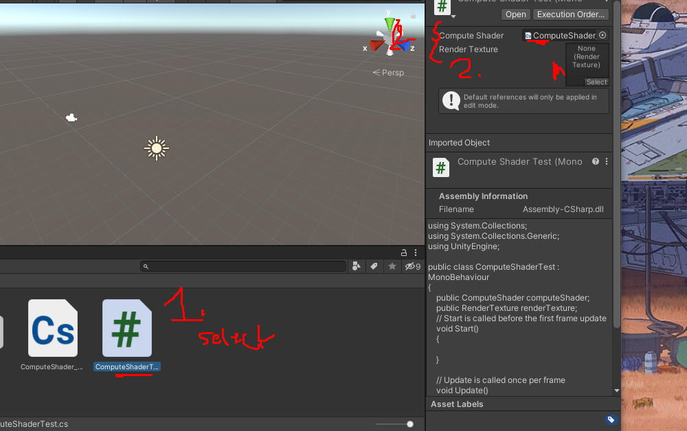
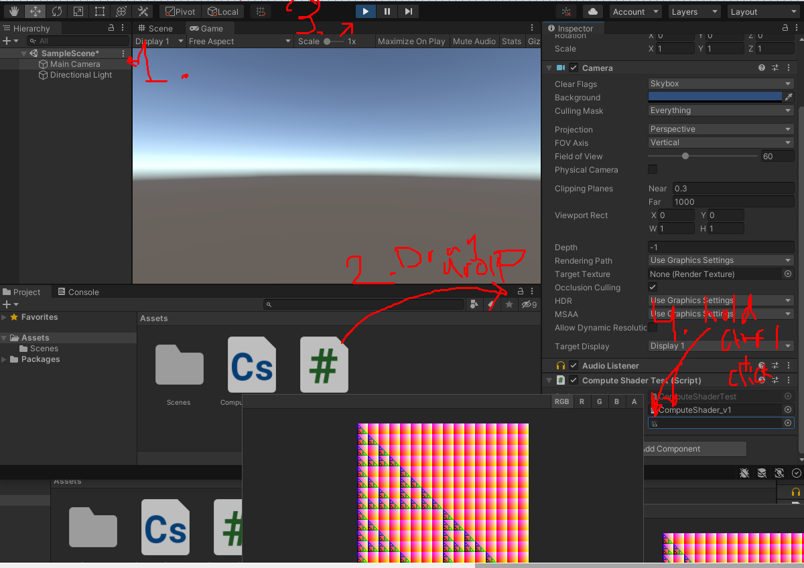

# Shaders

## Basics

### Allmänt

* Shaders i unity baseras på olika språk: C, C#, och ett shader-specifikt språk.
* Regardless of which type you choose, the actual Shader code is always wrapped in ShaderLab, which is used to organize the Shader structure. It looks like this:

```c#

Shader "MyShader" {
    Properties {
        _MyTexture ("My Texture", 2D) = "white" { }
        // Place other properties like colors or vectors here as well
    }
    
    SubShader {
        // here goes your
        // - Surface Shader or
        // - Vertex and Fragment Shader or
        // - Fixed Function Shader
    }
    
    SubShader {
        // Place a simpler "fallback" version of the SubShader above
        // that can run on older graphics cards here
    }
}
```


## Compute Shaders

### Basics


***Like an extension of a c# script***

* The compute shader works like an extension of a C# script


***Basics***

* Similar to [regular shaders](https://docs.unity3d.com/Manual/class-Shader.html), compute shaders are Asset files in your project, with a *.compute* file extension. They are written in DirectX 11 style [HLSL](http://msdn.microsoft.com/en-us/library/windows/desktop/bb509561.aspx) language, with a minimal number of #pragma compilation directives to indicate which functions to compile as compute shader kernels.

* Here’s a basic example of a compute shader file, which fills the output texture with red:

  ```c
  // test.compute
  
  #pragma kernel FillWithRed
  
  RWTexture2D<float4> res;
  
  [numthreads(1,1,1)]
  void FillWithRed (uint3 dtid : SV_DispatchThreadID)
  {
      res[dtid.xy] = float4(1,0,0,1);
  }
  ```

* The language is standard [DX11 HLSL](https://docs.unity3d.com/Manual/SL-ShadingLanguage.html), with an additional `#pragma kernel FillWithRed` directive. 


***Kernel***

* One compute shader Asset file must contain at least one`compute kernel` that can be invoked, 

* and that function is indicated by the `#pragma directive`. 

* ***What this means:***  the `#pragma kernel FillWithRed` is that we are providing the name of the program, such that it can be called. 

* There can be more kernels in the file; just add multiple `#pragma kernel` lines

* When using multiple `#pragma kernel` lines, note that comments of the style `// text` are not permitted on the same line as the `#pragma kernel` directives, and cause compilation errors if used.

* The `#pragma kernel` line can optionally be followed by a number of preprocessor macros to define while compiling that kernel, for example:

  ```c
  #pragma kernel KernelOne SOME_DEFINE DEFINE_WITH_VALUE=1337
  #pragma kernel KernelTwo OTHER_DEFINE
  // ...
  ```


### Default compute shader code

***Getting started***

```c#
// Each #kernel tells which function to compile; you can have many kernels
#pragma kernel CSMain

// Create a RenderTexture with enableRandomWrite flag and set it
// with cs.SetTexture
RWTexture2D<float4> Result;

[numthreads(8,8,1)]
void CSMain (uint3 id : SV_DispatchThreadID)
{
    // TODO: insert actual code here!

    Result[id.xy] = float4(id.x & id.y, (id.x & 15)/15.0, (id.y & 15)/15.0, 0.0);
}

```

* First line: `#pragma kernel CSMain` is providing the name of the program we want the compiler to run (note that ***we define this function later in the code***)
* ***The texture***: unity generates a texture, as a render texture TARGET. 
  * Specifies that unity will read and write to it as a ***variable***
  * The `RWTexture2D`
* `[numbthreads()]`: provides the dimensions thread groups to be used by our compute shader
  * keep in mind that the compute shader runs code in parallel on the  gpu
  * the numthreads provide how this computation on the gpu will be performed. 
* inside the `CSMain` function: 
  * it takes the texture `Result` and the given index o our thread (compute cell), and assigns it a color. 
* `float(4)` for color: we have a 4d-vector for the RGBa vector, I assume, that we are returning to the `Result` texture. 


***Compute shader has no target***

* Because the compute shader does not have a target, e.g. a mesh, 
* we need to tell it how, when, where it will run. 


***In unity***

* **C# script**: create a new C# script in unity. 
* Name it "ComputeShaderTest" 
* create a public reference to our compute shader inside the class: add `public ComputeShader computeShader;`


```c#
using System.Collections;
using System.Collections.Generic;
using UnityEngine;

public class NewBehaviourScript : MonoBehaviour
{

    // I wonder if we are calling a native template that is
    // the ComputeShader inside unity, or if it is the 
    // compute shader that we have scripted ourselves that 
    // we need to call, in that case the name is incorrect. 
    public ComputeShader computeShader; // assign our newly created shader to this. 
    public RenderTexture renderTexture;

    // Start is called before the first frame update
    void Start()
    {
        renderTexture = new RenderTexture(256,256, 24)
        renderTexture.enableRandomWrite = true;
        renderTexture.Create();


        computeShader.SetTexture(0, "Result", renderTexture);
    }

    // Update is called once per frame
    void Update()
    {
        
    }
}

```

* The `public ComputeShaader computeShader`: seems to get exposed in the unity editor. 
  * The `ComputeShader` seems to be a unity class. 
  * When we write `public [SomeClass] [name we provide]`: it will get exposed in the unity editor, and then I assume that we in turn specifically provide the name of our compute shader script. 
  * 
* `computeShader.SetTexture(0, "Result", renderTexture);`
  * assigning the texture to the our computeshader
  * First parameter of the `computeShader.SetTexture`, is the KERNEL INDEX (in this case `0`)
  * KERNEL INDEX: each kernel in our shader is assigned an index
  * because we only have one kernel (a single method CSMain) in our computeshader, we know 
  * it to have index 0 
  * otherwise we would be able to use the FindKernel method to find the kernel by name. 


***Getting a preview of the compute shader***

* The `Assets/ComputeShaderTest.`

```c#
using System.Collections;
using System.Collections.Generic;
using UnityEngine;

public class ComputeShaderTest : MonoBehaviour
{
    public ComputeShader computeShader;
    public RenderTexture renderTexture; 
    // Start is called before the first frame update
    void Start()
    {
        renderTexture = new RenderTexture(256, 256, 24);
        renderTexture.enableRandomWrite = true;
        renderTexture.Create();


        computeShader.SetTexture(0, "Result", renderTexture);
        computeShader.Dispatch(0, renderTexture.width / 8, renderTexture.height / 8, 1);
    }

    // Update is called once per frame
    void Update()
    {
        
    }
}

```

* and `Assets/ComputeShader_v1.compute`

* ```c
  // Each #kernel tells which function to compile; you can have many kernels
  #pragma kernel CSMain
  
  // Create a RenderTexture with enableRandomWrite flag and set it
  // with cs.SetTexture
  RWTexture2D<float4> Result;
  
  [numthreads(8,8,1)]
  void CSMain (uint3 id : SV_DispatchThreadID)
  {
      // TODO: insert actual code here!
  
      Result[id.xy] = float4(id.x & id.y, (id.x & 15)/15.0, (id.y & 15)/15.0, 0.0);
  }
  
  ```

* **Camera**: Next select the camera, and move the `ComputeShaderTest.cs` to the camera components, drag and drop

* **Play generates texture**: Next click play, such that the texture gets generated and stored in the `RenderTexture`  public class

* **Play and select field:** preview the generated texture, press PLAY and while in play select the `RenderTexture` field:

* 


## Projects

### Wireframe

* Add 3d cube to the env
* `create new shader`: Create > Shader > Standard Surface Shader


***Setting the menu location for the shader***

```c#
Shader "Simple Talk/Wireframe"
{
    Properties
    {
        _Color("Color", Color) = (1,1,1,1)
        _Wireframe("Wireframe thickness", Range(0.0, 0.005)) = 0.0025
        _Transparency("Transparency", Range(0.0, 1)) = 0.5
    }
    
}
```

* When editing any ***material*** there is a ***shader*** menu, you can navigate to select which shader this material use. 
* In this case 


***Properties***

* The general structure of a property is the variable name, 
* the property’s designation in the editor, what kind of property it is, and then a default value. 
* For example, the first variable is given the name `_Color` while in the editor it will display as whatever is in the quotations. 
* Then you specify that it will be of the `Color` value type and give it a default color of white: `(1,1,1,1)` 
* `_Wireframe` and `_Transparency` are a little different in that their value types are given as a range of floats. 
* This means in the Unity editor those variables can be edited by moving a slider


***Subshader***

* Next comes the `SubShader`, which defines rendering passes and optionally can set up any state common to all passes. 
* In other words, it’s the part that makes the shader what it is. 
* The `SubShader` goes inside the Shader under the `Properties {}` - section.


```c#
Shader "Simple Talk/Wireframe"
{
    Properties
    {
        _Color("Color", Color) = (1,1,1,1)
        _Wireframe("Wireframe thickness", Range(0.0, 0.005)) = 0.0025
        _Transparency("Transparency", Range(0.0, 1)) = 0.5
    }
    
    
    SubShader
    {
        Tags { "Queue" = "Transparent" "RenderType" = "Transparent"}
        Lod 200
            
        Pass
        {
            Blend SrcAlpha OneMinusSrcAlpha
            Cull Back
                
            // All remaining code goes in Pass
        }
    }    
}
```


***Material born from this shader***

* material born from this shader to be transparent, give the subshader:
  * render type "Transparent"
  * queue "Transparent": remove this tag, to have a full object, with wires around it,. 
* Let unity know that it is able to "fade". 
* The reason is simple – it doesn’t affect anything. Materials appear to ignore the alpha value in the color selection on primarily focus on the RGB values. At that point, the biggest reason to keep the alpha value is tradition.
* Tags can also be queried later in other C# scripts for whatever purpose you may need. This is similar to the typical tagging system seen when creating an object in Unity. Finally, there’s the `LOD` line with a number beside it. `LOD` stands for Level Of Detail and controls, you guessed it, the level of detail in the material. For example, if an object has a material that makes it look like a concrete tile, the LOD controls how nice looking that concrete tile can be. You would typically have multiple LOD options for various computer builds but since this is a wireframe shader it’s reasonable to assume that the material derived from this shader could run on a toaste


***SubShader Pass***

* Within `SubShader` you now must create a `Pass`. All the prep work is out of the way, meaning `Pass` will contain the code that defines the material’s appearance.
* The `Blend` line exists to create transparent objects and nothing more. 
* `Cull Back` is you telling Unity to ***not render polygons*** facing away from the viewer. 
* There is also `Cull Front`, which does the opposite of `Back` and stops the rendering of polygons facing the viewer, and `Cull Off` which draws all polygons regardless if they are currently being viewed. 
* This example chose `Cull Back` with the belief that it looks better but you may adjust this as you wish.


***Create the shader***

* It’s now time to put those properties to use in some functions and structs. Before beginning, you’ll need to let Unity know that Cg is in use until otherwise noted by adding the following in `Pass`

```c++
CPROGRAM
```

Then:

```c++
CPROGRAM

#pragma vertex vertexFunction
#pragma fragment fragmentFunction
#pragma geometry geometryFunction
#include "Unity.CG.cginc"

struct v2g
{
    float4 pos : SV_POSITION;
};

struct g2f;
{
    float4 pos : SV_POSITION
    float3 bary : TEXCOORD0;
}
```


***Pragmas and include***

* The pragma statements are very much like method declarations that you may normally find in a C# scrip
* They will be defined later in the coding process
* At the end there’s an include statement, which lets the editor know you’ll be using some commonly used helper functions from that library.


***vector***

* `v2g` stands for `vector 2 geometry` and contains a single variable – a float4 named `pos`, with `SV_POSITION` being what’s known as a semantic. 
* Semantics is how you explain to the editor what the variable’s “intent” is. 
* In this case, the intent is to output the clip space position of a vertex, this way the GPU knows where on screen to place pixels. 
* The next struct, `g2f` (standing for *geometry 2 fragment*) has all the same info as `v2g` but with an additional float3 named `bary` which uses the `TEXCOORD0` semantic. 
* `TEXCOORD0` is simply the first `UV` coordinate in the shader, given as a float3 in this example but can also be done with float2 or float4.


***vertexFunction***

```c++
v2g vertexFunction(appdata_base v){
    v2g o;
    o.pos = UnityObjectToClipPos(v.vertex);
    return o;
}
```


***geometryFunction***

* Earlier you wrote some pragma statements, which acted effectively as function declarations. 
* It’s time to give those functions a little code to execute. 
* First up is `vertexFunction` which, as the name suggests, gets the various vertexes ready for the next two functions.
* Then comes `geometryFunction`:


```c++
[maxvertexcount(3)]
void geometryFunction(triangle v2g IN[3], inout TriangelStream<g2f> triStream){
    g2f o; 
    float3 coords[3] = {
        float(1,0,0),
        float(0,0,1),
        float(0,1,0)
    }
    for(int i=0; i<3; i++){
	    o.pos = IN[i].pos
    	o.bary = coords[i];
	    triStream.Append(o);
        
    }    
}
```

* Here the different triangles that make up an object are being drawn. 
* This is possibly the busiest function in the whole script, though you’ll notice a pattern – a few lines of code are being repeated, just with different elements in the `IN` array and the `bary` value from the `g2f` struct being given different float3 values each time. 
* There’s also an attribute at the top of the function specifying that the maximum vertex count per shape is three, which makes sense as it is triangles being drawn and thus only need three vertexes per triangle. 


***Fragmentfunction***

* The last step remaining is to change the object based on the color, thickness and transparency values the user enters.


```c++
float _Wireframe;
fixed4 _Color;
float _Transparency;
fixed4 fragmentFunction(g2f i) : SV_TARGET{
    float value = min(i.bary.x, (min(i.bary.y, i.bary.z)));
    value = exp2(-1 / _Wireframe * value * value);
    fixed4 col = _Color;
    col.a = _Transparency;
    return col * value;
}

ENDCG
```

endresult..:

```c++
Shader "Simple Talk/Wireframe"
{
	Properties
	{
		_Color("Color", Color) = (1,1,1,1)
		_Wireframe("Wireframe thickness", Range(0.0, 0.005)) = 0.0025
		_Transparency("Transparency", Range(0.0, 1)) = 0.5
	}

		SubShader
	{
		Tags{ "Queue" = "Transparent" "RenderType" = "Transparent" }
		LOD 200

		Pass
		{
			CPROGRAM

			#pragma vertex vertexFunction
			#pragma fragment fragmentFunction
			#pragma geometry geometryFunction
			#include "Unity.CG.cginc"

			struct v2g
			{
				float4 pos : SV_POSITION;
			};
			
			struct g2f
			{
				float4 pos : SV_POSITION
				float3 bary : TEXCOORD0;
			};

			v2g vertexFunction(appdata_base v) {
				v2g o;
				o.pos = UnityObjectToClipPos(v.vertex);
				return o;
			}

			[maxvertexcount(3)]
			void geometryFunction(
				triangle v2g IN[3],
				inout TriangleStream<g2f> triStream
			) {
				g2f o; 
				float3 coords[3] = {
					float3(1,0,0),
					float3(0,0,1),
					float3(0,1,0)
				};
				for (int i = 0; i < 3; i++) {
					o.pos = IN[i].pos;
					o.bary = coords[i];
					triStream.Append(o);
				}
			}

			float _Wireframe;
			fixed4 _Color;
			flaot _Transparency;

			fixed4 fragmentFunction(g2f i) : SV_TARGET{
				float value = min(i.bary.x, (min(i.bary.y, i.bary.z)));
				value = exp2(-1 / _Wireframe * value * value);
				fixed4 col = _Color;
				col.a = _Transparency;
				return col * value;
			}

			ENDCG
		}

	}
}
```

* You’ll notice the three variables kicking things off look awfully familiar. 
* They share the name of the properties declared early in the script. 
* Why the repeat? 
* Remember that you’re currently working in the `CGPROGRAM` section and it needs to take in the properties defined early on to make any use of them. 
* You can see their use implemented in `fragmentFunction`, where the object is given its assigned color, wireframe thickness, and transparency. 
* Finally, the script ends with `ENDCG`, which tells Unity that Cg is not being used any longer.


***Create new material from the shader***

* Right click the shader in the assets window
* then Create > Material
* This will create a new material of the shader
* We can now add this material to our object in Unity to get shaded by our shader. 


## Languagespecific stuff

### & bitwise operator

We have notes in our code that there are:

```c#
int a = 0b1100;
int b = 0b1000;
Debug.Log(a & b);
```

***What does the & operator do in this case***: 

* Assume that the numbers are in 4 bits. 

* The operation 3 & 1. 

* Looks at the numbers in binary so 1100 and 1000 and will output the number where both values are . 1000 = 1

* ```c#
  (decimal 5)    0 1 0 1
                 | | | | AND operation
  (decimal 3)    0 0 1 1 
                       | Results with
  (decimal 1)  = 0 0 0 1 
  ```

  


